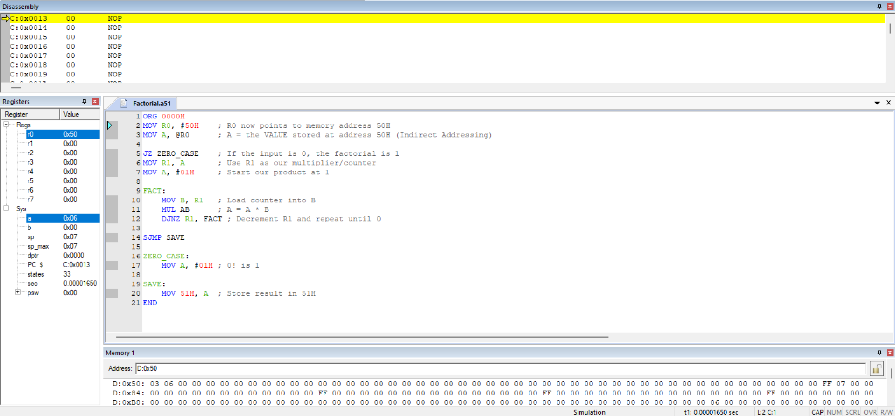

# FACTORIAL-OF-A-NUMBER
# FACTORIAL OF A NUMBER USING 8051 (Keil)

## AIM
To write and execute an Assembly language program to perform the factorial of a number using 8051 Keil.

---

## APPARATUS REQUIRED
- Personal computer with Keil software

---

## ALGORITHM
1. **Start**
2. **Input**: Read the number `n`.
3. **Initialize**:
   - Set factorial to `1`.
   - Set `i` to `1`.
4. **Loop**: While `i` is less than or equal to `n`:
   - Multiply factorial by `i`.
   - Increment `i` by `1`.
5. **Output**: Store or print the value of factorial.
6. **End**

---

## FLOWCHART


---

## PROGRAM
```asm
ORG 0000H
MOV R0, #50H    ; R0 now points to memory address 50H
MOV A, @R0      ; A = the VALUE stored at address 50H (Indirect Addressing)

JZ ZERO_CASE    ; If the input is 0, the factorial is 1
MOV R1, A       ; Use R1 as our multiplier/counter
MOV A, #01H     ; Start our product at 1

FACT:
    MOV B, R1   ; Load counter into B
    MUL AB      ; A = A * B
    DJNZ R1, FACT ; Decrement R1 and repeat until 0

SJMP SAVE

ZERO_CASE:
    MOV A, #01H ; 0! is 1

SAVE:
    MOV 51H, A  ; Store result in 51H
END

```
OUTPUT



---
MANUAL CALCULATIONS

---

RESULT

Thus, the factorial of a number was calculated and executed successfully using 8051 Keil.

---


